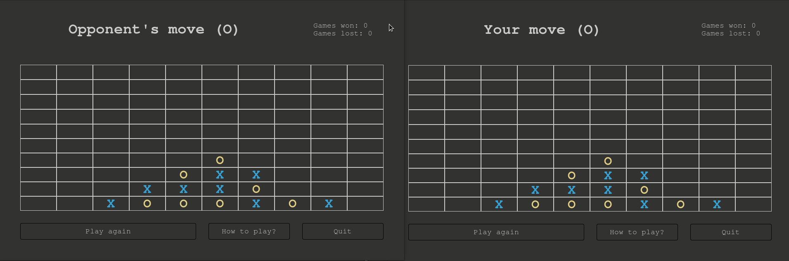

# Tic-Tac-Toe-C

### Table of contents
1. [Introduction](#intro)
2. [Game rules](#rules)
3. [Code overview](#code)
4. [Compiling the game from source](#compile)

### Introduction

This is a modified, two-player Tic Tac Toe game written in C and GTK+3. It runs in two instances communicating with each other through local files. \
You can run it by downloading the compiled build from `builds/` folder or by [compiling from source](#compile). Provided binaries might still require having GTK installed though.

### Game rules
There are two types of moves you can make:
1. Click an empty square to place your piece on top of the selected column.
2. Click a filled square to move the piece from the column's bottom to it's top, then place your piece on top of the selected column.

First player to get 4 or 5 (chosen at the start of the game) of his own pieces in a row, column or a diagonal wins.

### Code overview
The project is split into following modules (inside `src/` directory)
1. `app` handles initializing the window and loading the `UITemplate.glade` with `style.css`. It also exposes functions to show/hide all pages. 
2. `connection` takes care of sending and receiving messages between two instances of the program by writing and reading to a file (both instances need to run in the same directory). It uses `lin_fifo.c` or `win_fifo.c` as a backend on Linux and Windows appropriately.
3. `constants` stores useful constants and enums including strings passed between program instances as messages.
4. `game` initializes the gameplay page and handles gameplay logic. It uses two submodules: 
   - `game_utils` with functions checking the game's winner and a few smaller board utilities.
   - `game_gtk_utils` with utility functions for interacting with GTK objects.
5. `how_to_play` initializes the "how to play" page.
6. `lobby` initializes the lobby page and handles logic for connecting players with chosen number of elements to win.
7. `menu` initializes the menu page.
8. `modals` include logic for showing popup windows (for instance when the game ends).

Also, inside `resources/` there are:
1. `UITemplate.glade` which is a static description of the UI (Created with Glade).
2. `style.css` containing basic styles to make the game look more or less the same on different platforms.
3. `gresource.xml` which tells `glib` what resources it should include in the project. The resources can be compiled to C by running the `compile_resources.sh` script. The resulting `resources.c` is then compiled with the rest of the project.

### Compiling the game from source
#### On Linux:
1. Make sure GCC, GTK and CMake are installed. On Ubuntu: \
`sudo apt-get install gcc` \
`sudo apt-get install libgtk-3-dev` with all dependencies \
`sudo apt-get install cmake`
2. Compile resources: \
`cd resources` \
`./compile_resources.sh` \
`cd ..`
3. Build the project (inside project's root): \
`cmake -S . -B cmake-build-debug/` \
`cmake --build cmake-build-debug/ --target Tic_Tac_Toe_C`
4. Run the game (You should run it in two instances): \
`cd cmake-build-debug` \
`./Tic_Tac_Toe_C`

#### On Windows:
1. Install GCC, GTK and CMake using MSys2 (https://www.gtk.org/docs/installations/windows/) \
   Especially run: \
   `pacman -S mingw-w64-x86_64-gtk3` \
   `pacman -S base-devel mingw-w64-x86_64-toolchain` \
   `pacman -S mingw-w64-x86_64-cmake`
2. Add `C:\msys64\mingw64\bin` to `PATH`
3. In `CMakeLists.txt` change `ADD_EXECUTABLE(... src/connection/lin_fifo.c ...)` to `ADD_EXECUTABLE(... src/connection/win_fifo.c ...)`
4. Compile resources: \
   `cd resources` \
   `"C:\msys64\mingw64\bin\glib-compile-resources.exe" gresource.xml --target=resources.c --generate-source`
5. Build the project (inside project's root): \
   `C:\msys64\mingw64\bin\cmake.exe -DCMAKE_BUILD_TYPE=Debug -DCMAKE_MAKE_PROGRAM=C:/msys64/mingw64/bin/make.exe -DCMAKE_C_COMPILER=C:/msys64/mingw64/bin/gcc.exe -G "CodeBlocks - MinGW Makefiles" .` \
   `C:\msys64\mingw64\bin\cmake.exe --build . --target Tic_Tac_Toe_C -- -j 4`
6. Run the game (You should run it in two instances): \
   `cd cmake-build-debug` \
   `Tic_Tac_Toe_C.exe`
